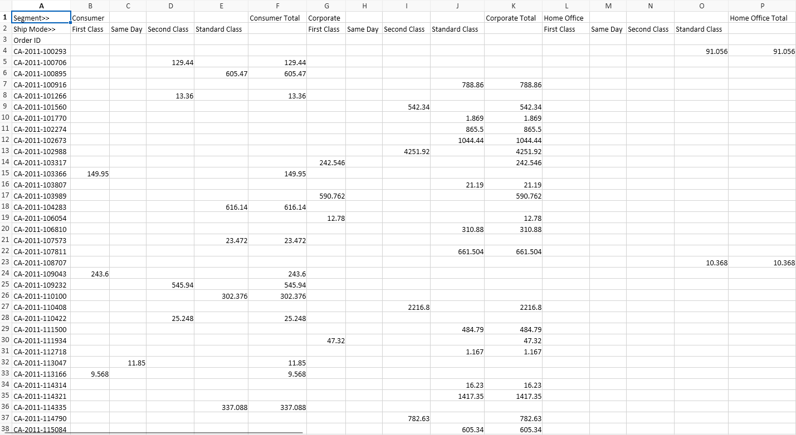
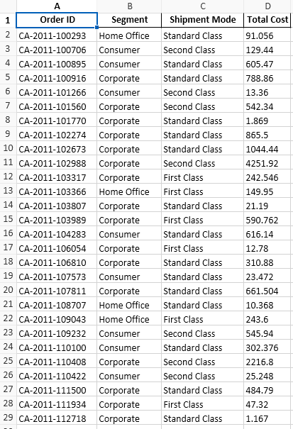

import pandas as pd

# The excel file is originally formated like this

### We need to reformat the code to be ready for Data Analysis 

### After reading the excel carefully we find out that :
### The first segement refers to consumers , second to corporate and third to Home office

### Secondly  *"First Class"* 	*"Same Day'*	*"Second Class"*	*"Standard Class"* all can be grouped to ship Mode

### Thirdly , since there is only one option between  ship methods , total cost is equivalent to shipment cost

## Import Data from Excel

df = pd.read_excel('Dirty-Data-Sample1.xlsx', sheet_name="Dirty 1")

df= df.round(4)

df2 =  df[[df.columns[0]]].copy()   # COPY First column

df2 = df2.drop(df.index[:2])        # REMOVE First two rows

df2 = df2.rename(columns={'Segment>>': 'Order ID'})  # Rename Column name

## Create an array that will contain All data after transformation
df3 = df.values

df3 = pd.DataFrame(df3,  columns=df3[0])

df3 = df3.drop(df.index[:2])

df3 = df3.drop(df.index[-1])

df3 = df3.rename(columns={'Ship Mode>>': 'Order ID'})

## Run Excel Transforming Data , Create a new Array that will contain the transformed values

### The final format Will be [Order ID , Segment , Shipment Method , Total Value]  

<pre>
    
array = []
for index, row in df3.iterrows():
    print(f"Row {index}:"  
    counter = 0
    for column, value in row.items():
        if column == "Order ID":
            ID =value
        elif  str(value) != "nan":
            value = round(value,4)
            if 1 < counter <= 4:
                array.append([str(ID), str("Consumer"),str(column),str(value)])
                print(f"  {column}: {value} {counter}")
                break
            elif 5 < counter <=9:
                array.append([str(ID),str("Corporate"), str(column), str(value)])
                print(f"  {column}: {value} {counter}")
                break
            else:
                array.append([str(ID),str("Home Office"),str(column),str(value)])
                print(f"  {column}: {value} {counter}")
                break
        counter += 1
</pre>

## Create new sheet  with the Format "Order ID","Segment","Shipment Mode","Total Cost"

<pre>
new_sheet = pd.DataFrame(array)
headers = ["Order ID","Segment","Shipment Mode","Total Cost"]
new_sheet.columns = headers
print(new_sheet)
with pd.ExcelWriter("Dirty-Data-Sample1.xlsx", mode='a') as writer:
    new_sheet.to_excel(writer, sheet_name='Cleaned_Data',index=False)
</pre>
## Final look of Spreadsheet , Ready for data analysis

