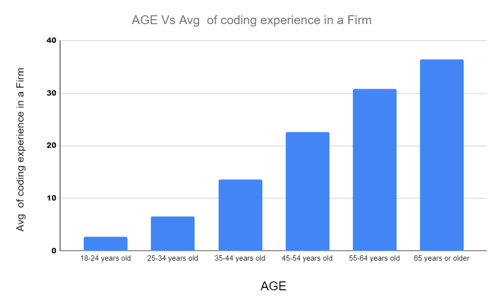

## In this Project I was asked to confirm whether on-site workers are getting paid more than remote ones
## TOOLS : Google Sheets , Tableau
### The dataset comes from Stack Overflow and is labeled as "stack-overflow-developer-survey-2023"
### This dataset represents developers from across the globe , their working experience , working style , learning progress  ,salary e.t.c

### First we need to identify which  data are useful for our analysis scenario and which are not

### We choose the columns:   "Main branch" (Developer as professional job)

### "Age" for better understanding 

### "Employment"( Full time , part time)

### "Remote Work" (On-Site , Hybrid , Remote)

### "EdLevel (Degree , Bachelor's ,Master e.t.c)

### "YearsCodePRo" (represents years of coding experience in a firm )

### "Currency(US Dollars , Euros e.t.c.)

### "Converted Comp Yearly" (annual salary in USD)

## Now we need to compare the average salaries of Remote workers  with that of Hybrid workers and On-Site workers.

## Our first hypothesis suggests the initial hypothesis is False and remote workers actually get paid more .
### We need to filter data so we are sure we havent made any mistakes and we are not biased. 

### We identify that salaries between countries differ a lot and and so are the numbers of people for each country  so

### we decide to filter data for US citizens only

### We also need to filter any  Null values that may exist in the sheet. 

### Although "Employement" (full-time , part-time , contract) highly affects  payment we identify that in all three cases (Remote ,Hybrid , On-Site) data are equally distributed .

### As it seems though  On-Site workers still remain at the bottom of the chart .

  

## Continuing the analysis we identify an unsual insight 
### As it seems the older someone is , the more coding experience he has , which is natural . 

## On the other hand more coding experience does not translate to bigger salaries

## To further explain we partitioned the graph to 3 smaller one with some help of Tableau

<noscript></noscript><object class='tableauViz'  style='display:none;'><param name='host_url' value='https%3A%2F%2Fpublic.tableau.com%2F' /> <param name='embed_code_version' value='3' /> <param name='path' value='shared&#47;ZNNSN8SBH' /> <param name='toolbar' value='yes' /><param name='static_image' value='https:&#47;&#47;public.tableau.com&#47;static&#47;images&#47;ZN&#47;ZNNSN8SBH&#47;1.png' /> <param name='animate_transition' value='yes' /><param name='display_static_image' value='yes' /><param name='display_spinner' value='yes' /><param name='display_overlay' value='yes' /><param name='display_count' value='yes' /><param name='language' value='en-US' /></object>
                

