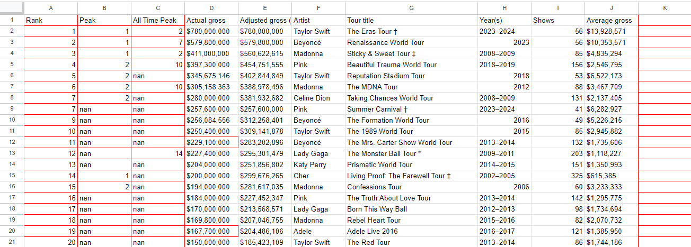

In this project we have a dataset scraped from  https://en.wikipedia.org/wiki/List_of_highest-grossing_concert_tours_by_women 
which reflects most sucessful concerts by women artists

First we read the csv file 

import pandas as pd

file_path = 'C:/Users/Montre/Desktop/data analyst/pandas 🐼/archive2/practise_proj2.csv'

# Use pandas to read the CSV file
data = pd.read_csv(file_path)

After an initial examination of data we need to some transformations to better handle the data

#transform non-breaking characters space to space to acess some columns

data.rename(columns={'Actual{NBSP}gross': 'Actual gross'}, inplace=True)
data.rename(columns={'Adjusted{NBSP}gross (in 2022 dollars)': 'Adjusted gross (in 2022 dollars)'} , inplace=True)

Then we are looking for dirty data 

Since we scraped the data from wiki there are multiple reference points that need to be taken out of the columns

#remove references from peak and all time peak columns
for column  in data.columns:
    for i, row in enumerate(data[column]) :
        #removes "[x] from row
        cleaned_row =str(row).split("[")[0]
        data.at[i, column] = cleaned_row

Then we remove the ref. column as it is not nessecary

#drop unnecessary column
data = data.drop('Ref.' , axis =1 )

# we acess types of column 
data.dtypes

