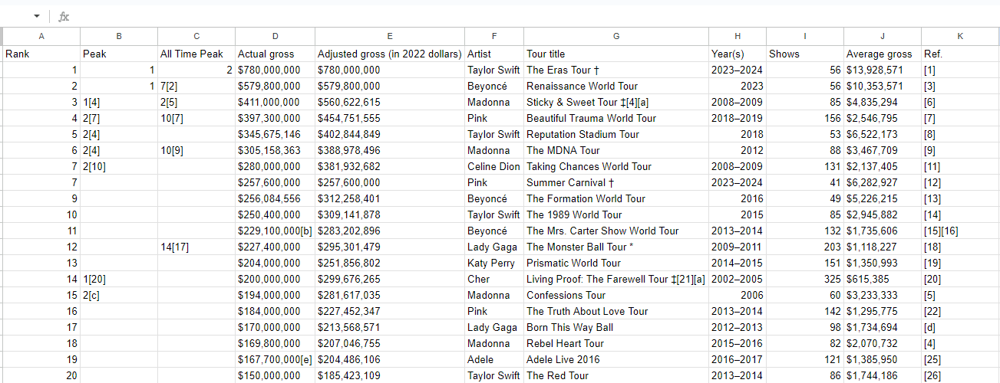
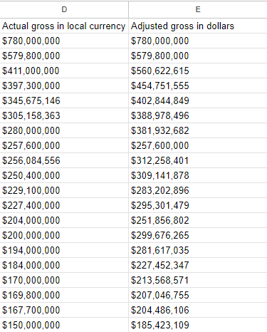
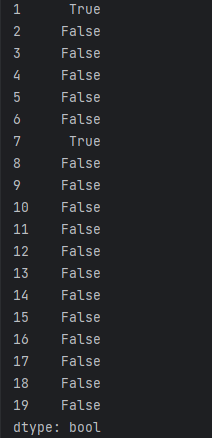

In this project we have a dataset scraped from  https://en.wikipedia.org/wiki/List_of_highest-grossing_concert_tours_by_women 
which reflects most sucessful concerts by women artists

# First we read the csv file 

import pandas as pd
```python
file_path = 'C:/Users/Montre/Desktop/data analyst/pandas 🐼/archive2/practise_proj2.csv'


#Use pandas to read the CSV file
data = pd.read_csv(file_path)
```


After an initial examination of data we need to some transformations to better handle the data

```python
#transform non-breaking characters space to space to acess some columns
data.rename(columns={'Actual{NBSP}gross': 'Actual gross'}, inplace=True)
data.rename(columns={'Adjusted{NBSP}gross in dollar)': 'Adjusted gross in dollars'} , inplace=True)
```
Then we are looking for dirty data 

## Since we scraped the data from wiki there are multiple reference points that need to be taken out of the columns

```python
#remove references from peak and all time peak columns
for column  in data.columns:
    for i, row in enumerate(data[column]) :
        #removes "[x] from row
        cleaned_row =str(row).split("[")[0]
        data.at[i, column] = cleaned_row
```


Then we remove the ref. column as it is not nessecary
```python
#drop unnecessary column
data = data.drop('Ref.' , axis =1 )
```


## Then we need to prepare the data for numeric analysis
```python
#we acess types of column 
data.dtypes
```
We see that there are numemerous columns that need to be changed to numeric


But first we need to transform data to numeric format 

We reformat dollar columns "Average gross" , "Actual gross in local currency  " , "Adjusted gross in dollars"

```python
for column in data.columns:
    if ("gross" in column):
        #print(column)
        for i,row in enumerate(data[column]) :
            data.at[i,column] = row.replace("$", "")
            data.at[i, column] = data.at[i,column].replace(",", "")
```




```python
#convert columns types
data['Actual gross in local currency'] = pd.to_numeric(data['Actual gross in local currency'], errors='coerce')
data['Adjusted gross in dollars'] = pd.to_numeric(data['Adjusted gross in dollars'], errors='coerce')
data['Average gross'] = pd.to_numeric(data['Average gross'], errors='coerce')
data['Shows'] = pd.to_numeric(data['Shows'], errors='coerce')

```

# We now Identify a major problem . The are two columns for total gross , one for total gross in local currency and one for total gross in dollars . 
## We compare the rows with the product of shows *  average gross based on each column accordingly
```python
    
#iterate on columns
actual_gross = True
adjusted_gross = False
print(data.columns)
for i in range(data.shape[0]):
    print(f"for row : {i}  num of shows is {data.loc[i,'Shows']} , num of average gross is {data.loc[i,'Average gross']} ,actual gross {data.loc[i,'Actual gross in local currency']} , adjusted gross  {data.loc[i,'Adjusted gross in dollars']}")
actual_gross = round(data['Shows'] == (data['Actual gross in local currency']//100) // (data['Average gross']//100))
adjusted_gross = round(data['Shows'] == (data['Adjusted gross in dollars']//100) //  (data['Average gross']//100))
print(actual_gross,adjusted_gross)
```


<div class="image-container">
    
    
</div>

## We see that the two other columns are actually calculating the  local currency and not the currency in dollars .
## Since the shows are non-changing values that means that the average gross column constists of local currency and not dollars. 

We create a new column for computing average in dollars 
```python
data['number of average gross in dollars'] = round(data['Adjusted gross in dollars'] //  data['Shows'])
```

Last we take a look at the Year(s) column . We need to adjust it accordingly to help for analysis 
by splitting it to two seperate values 
```python
#get the "-" char
char = data.loc[0,'Year(s)'][4]
```
"if year  != "20xx-20xx" replace it with  "x-x" , Example : replaces 2015 with 2015-2015
data['Year(s)'] = data['Year(s)'].apply(lambda x: x if char in x else x + char + x)

#split the column to two seperate columns , delimitered by "-"
```python
data[['Start Year', 'End Year']] = data['Year(s)'].str.split(str(char), expand=True)
data['Start Year'] = pd.to_numeric(data['Start Year'], errors='coerce')
data['End Year'] = pd.to_numeric(data['End Year'], errors='coerce')
```
# At last we ensure that there are no outliers. For this we are using Z-scores with more than "3" values.

## Define threshold for outliers (e.g., Z-score > 3 or Z-score < -3)
```python
threshold = 3


z_scores1 = stats.zscore(data['Adjusted gross in dollars'])
z_scores2 = stats.zscore(data['number of average gross in dollars'])
z_scores3 = stats.zscore(data['Shows'])
z_scores4 = stats.zscore(data['Start Year'])
z_scores5 = stats.zscore(data['End Year'])


## Find outliers
outliers1 = data['Adjusted gross in dollars'][abs(z_scores1) > threshold]
outliers2 = data['number of average gross in dollars'][abs(z_scores2) > threshold]
outliers3 = data['Shows'][abs(z_scores3) > threshold]
outliers4 = data['Start Year'][abs(z_scores4) > threshold]
outliers5 = data['End Year'][abs(z_scores5) > threshold]

print(outliers1,outliers2,outliers3,outliers4,outliers5)
```
We see that the only outliers in our CSV are  325 shows at position 13 made by Cher with the title "Living Proof: The Farewell Tour" .
As we later identify this to be true on https://en.wikipedia.org/wiki/Living_Proof:_The_Farewell_Tour#:~:text=The%20tour%20kicked%20off%20in,with%20former%20husband%2C%20Sonny%20Bono.

## This means that our data are now cleanned .

Final we reorient data columns for better visual performance

```python
data = data[['Rank', 'Peak', 'All Time Peak', 'Artist', 'Start Year', 'End Year', 'Tour title', 'Shows', 'number of average gross in dollars',  'Adjusted gross in dollars']]


data.rename(columns={'Adjusted gross in dollars': 'overall gross in $'}, inplace=True)
data.rename(columns={'number of average gross in dollars': 'average gross in $'}, inplace=True)
```
 


